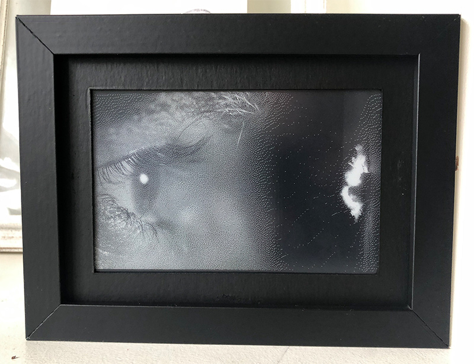
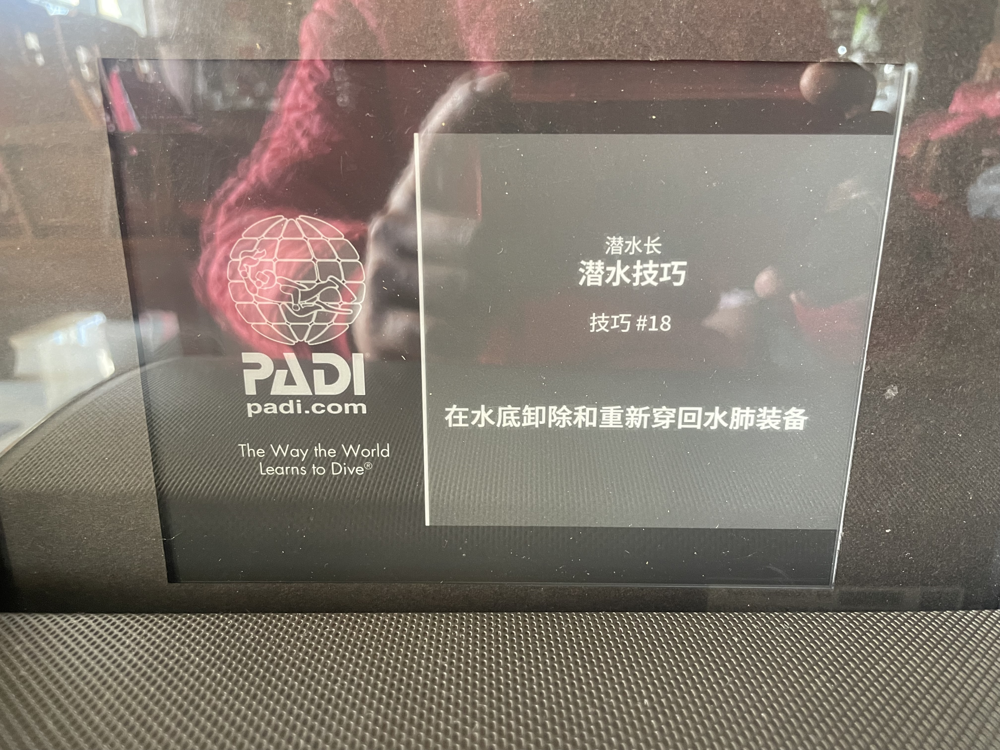

# 慢电影墨水屏播放器



一个在墨水屏上极慢速播放电影的树莓派项目。整合了微雪高清墨水屏 IT8951 驱动支持，兼容 Python 3.13+ 和 Pillow 10.0+。

## 硬件需求

**测试配置**：
- Raspberry Pi 4B
- Waveshare 6inch HD e-Paper HAT (IT8951)
- IKEA VÄSTANHED 画框

**推荐配置**：
- Raspberry Pi Zero 2 W（低功耗，更低成本）
- Waveshare Zero UPS（不间断电源）
- Waveshare 7.8inch e-Paper（照片清晰化）
- IKEA VÄSTANHED 画框



## 快速开始

### 方法一：一键安装（推荐）

```bash
# 克隆项目
git clone https://github.com/TwinsenLiang/SlowMovie.git
cd SlowMovie

# 运行一键安装脚本
./install.sh
```

安装脚本会自动完成：
- ✅ 检查 Python 版本和 SPI 接口
- ✅ 安装系统依赖（ffmpeg、编译工具等）
- ✅ 创建虚拟环境
- ✅ 安装主程序和驱动依赖
- ✅ 编译 IT8951 驱动（自动适配 Python 版本）
- ✅ 设置 SPI/GPIO 权限
- ✅ 运行屏幕测试

### 方法二：手动安装

<details>
<summary>点击展开手动安装步骤</summary>

#### 1. 启用 SPI 接口

```bash
sudo raspi-config
# 选择 Interface Options -> SPI -> Enable
```

#### 2. 安装依赖

```bash
# 系统依赖
sudo apt update
sudo apt install -y ffmpeg build-essential python3-dev swig liblgpio-dev

# 克隆项目
git clone https://github.com/TwinsenLiang/SlowMovie.git
cd SlowMovie

# 创建虚拟环境
python3 -m venv venv
source venv/bin/activate

# 安装 Python 依赖
pip install -r requirements.txt

# 安装墨水屏驱动
cd IT8951
pip install -r requirements.txt
USE_CYTHON=1 pip install --no-build-isolation ./
cd ..
```

> **Python 3.13+ 说明**：驱动已更新支持最新 Python，使用 Cython 从源码编译，兼容 Pillow 10.0+。

#### 3. 测试屏幕

```bash
./service.sh test
```

成功后会显示渐变图案和睡觉的企鹅。

#### 4. 设置权限（可选）

```bash
sudo usermod -aG spi,gpio $USER
# 重新登录生效，之后无需 sudo 运行
```

</details>

## 使用方法

### 服务管理

```bash
./service.sh start    # 启动服务（后台运行）
./service.sh stop     # 停止服务
./service.sh restart  # 重启服务
./service.sh status   # 查看状态
./service.sh logs     # 查看日志
```

### 命令行运行

```bash
source venv/bin/activate
python3 slowmovie.py [选项]
```

**常用参数**：
- `-f FILE` - 指定视频文件
- `-d DELAY` - 帧间延迟（秒，默认 120）
- `-i INCREMENT` - 跳帧数（默认 5）
- `-s START` - 起始帧
- `-r` - 随机模式

**示例**：
```bash
# 每 10 秒更新一帧
python3 slowmovie.py -f Videos/movie.mp4 -d 10 -i 1
```

## 开机自启

### 方法一：编辑启动脚本

```bash
sudo nano /etc/profile
# 在文件末尾添加：
cd ~/SlowMovie/ && ./service.sh start
```

### 方法二：使用 PM2

```bash
sudo npm install -g pm2
pm2 startup  # 复制输出的命令并执行

cd ~/SlowMovie/
pm2 start service.sh -- start
pm2 save
```

## 兼容性

### 支持的硬件架构
- ✅ 树莓派 Zero / Zero W (32位)
- ✅ 树莓派 1/2/3/4 (32位/64位)
- ✅ 树莓派 5 (64位)

### 软件要求
- Python 3.9+ (推荐 3.11 或 3.13)
- Raspberry Pi OS Bullseye / Bookworm
- Waveshare IT8951 系列墨水屏

详见 [COMPATIBILITY.md](COMPATIBILITY.md)

## 项目结构

```text
SlowMovie/
├── venv/              # Python 虚拟环境
├── requirements.txt   # 主程序依赖
├── service.sh         # 服务管理脚本
├── slowmovie.py       # 主程序
├── Videos/            # 视频文件目录
├── logs/              # 日志目录
└── IT8951/            # 墨水屏驱动模块
    ├── requirements.txt
    ├── setup.py
    └── IT8951/        # 驱动源代码
```

## 常见问题

**Q: 遇到 `longintrepr.h` 编译错误？**
A: Python 3.12+ 已移除此头文件，请按照快速开始步骤安装，使用 `USE_CYTHON=1` 编译。

**Q: 需要 sudo 权限？**
A: 执行权限设置步骤，将用户加入 `spi` 和 `gpio` 组。

**Q: 如何更换视频？**
A: 将 `.mp4` 文件放入 `Videos/` 目录，程序会自动播放。

**Q: 32位系统报 "wrong ELF class" 错误？**
A: `e-paper/` 目录包含 64 位预编译库，32 位系统请使用主项目的 IT8951 驱动。

## 参考资料

- [TomWhitwell/SlowMovie](https://github.com/TomWhitwell/SlowMovie) - 原始项目
- [GregDMeyer/IT8951](https://github.com/GregDMeyer/IT8951) - IT8951 驱动
- [Waveshare IT8951-ePaper](https://github.com/waveshare/IT8951-ePaper) - 官方驱动
- [Very Slow Movie Player](https://medium.com/@tomwhitwell/how-to-build-a-very-slow-movie-player-in-2020-c5745052e4e4) - 项目灵感

## 更新日志

详见 [CHANGES.md](CHANGES.md)

## License

本项目基于原项目的开源协议。
